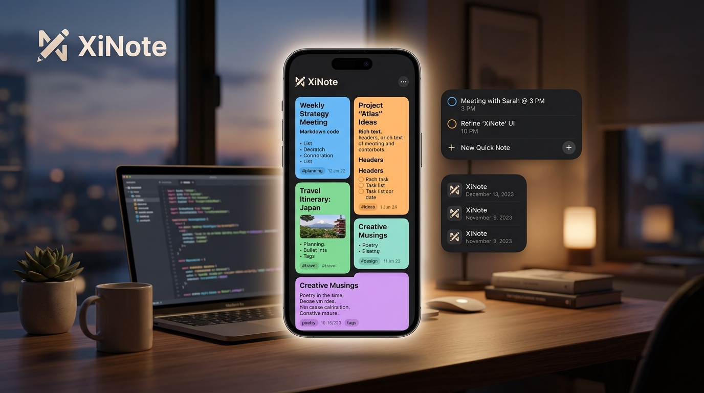

# XiNote 📝

  

XiNote 是一款优雅、现代且极简的高颜值 Markdown 记事本应用。它采用现代 Android 的 Jetpack Compose 框架与 Material Design 3 规范构建，致力于为用户提供最纯粹、高效的记录与灵感整理体验。

XiNote is an elegant, modern, and minimalist Markdown note-taking app designed with Jetpack Compose and Material Design 3. It delivers a pure, efficient environment for capturing your ideas and organizing your inspiration.

---

## ✨ 核心特色 / Core Features

### 1. 🌐 多语言自由切换 / Seamless Multilingual Support
*   **多国语言**：默认采用**中文**界面，同时完美支持**英文 (English)**、**日文 (日本語)**、**法文 (Français)** 以及**西班牙语 (Español)** 的一键无缝切换。
*   **全方位同步**：不仅应用内的主界面、编辑区、弹窗与提示完全中英日法西本地化，**桌面小组件（Widget）的界面文字也同样会随之实时动态更新**！
*   *   **Multilingual**: Chinese by default, with complete support for English, Japanese, French, and Spanish.
*   *   **Full Synchronization**: App screens, editing options, and even the **home screen widget texts** update in real-time when you switch languages!

### 2. 📝 Markdown 实时渲染与快捷输入 / Markdown Editor & Live Preview
*   **快捷工具栏**：专为移动端设计的 Markdown 工具栏，一键插入标题、加粗、斜体、单行代码、引用块、分割线和多行代码块。
*   **双栏/标签切换**：支持“编辑”与“预览”的快捷切换，极速渲染排版，让您的笔记井井有条。
*   *   **Markdown Shortcut Bar**: Insert headers, bold, italic, inline code, quotes, rules, and code blocks with a single tap.
*   *   **Instant Toggle**: Effortlessly switch between Edit and Preview tabs to see your formatted notes instantly.

### 3. 🎨 绚丽个性化配色卡片 / Vibrant Note Customization
*   **高颜值配色**：提供薄荷绿、天空蓝、薰衣草紫、蔷薇粉、温暖橙、石板灰等多款经过深思熟虑、温润护眼的浅色与暗色卡片配色。
*   **个性置顶**：核心笔记一键置顶（Pin），智能分区展示，确保最重要的灵感触手可及。
*   *   **Color Themes**: Beautiful eye-safe card palettes (Sage, Sky, Lavender, Rose, Peach, Slate, and Default).
*   *   **Note Pinning**: Securely pin your essential notes to the top in a distinct section for quick access.

### 4. 🧩 深度自定义桌面小组件 / Interactive & Adaptive Home Widget
*   **实时透明度调节**：内置高自由度的小组件设置中心。可在应用内通过滑块在 `0% - 100%` 范围内精确调节桌面小组件的背景不透明度。
*   **动态主题适配**：小组件不仅能完美契合系统的浅色/深色（Light/Dark）模式，还能在应用内的“小组件自定义”弹窗中通过精致的**桌面动态沙盒预览**进行实时效果预览，所见即所得。
*   *   **Opacity Customization**: Adjust widget transparency from `0%` to `100%` using a precise slider inside the app.
*   *   **System Theme Harmony**: Perfectly conforms to system-wide light/dark themes, with an interactive visual preview canvas in the settings dialog.

---

## 🛠️ 技术栈 / Technical Stack

*   **开发语言 (Language)**: Kotlin
*   **UI 框架 (UI Framework)**: Jetpack Compose (Material Design 3)
*   **本地数据库 (Database)**: Room Database (基于 SQLite 的高性能、离线优先本地存储)
*   **架构设计 (Architecture)**: MVVM (Model-View-ViewModel) 架构，单源数据流 (UDF)
*   **异步流 (Concurrency)**: Kotlin Coroutines & Flows
*   **桌面组件 (Widget)**: Android AppWidget Framework

---

## 📸 视觉与交互规范 / UI & UX Specifications

*   **无缝沉浸式体验**：全屏边缘到边缘 (`enableEdgeToEdge()`) 适配，完美处理系统导航栏与状态栏区域。
*   **无障碍支持**：所有交互元素触控区域均符合并优于 `48dp x 48dp` 的 Android 无障碍标准。
*   **精致微动效**：卡片点击水波纹、弹窗优雅淡入淡出、语言及透明度切换的即时响应。
